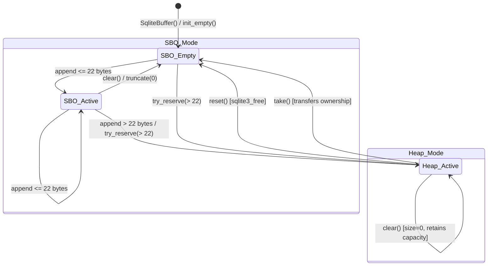

# Buffer Architecture

The `SqliteBuffer`, `SqliteString`, and `SqliteBufferSlice` classes provide the core memory-management and data-buffering infrastructure for high-performance C++ SQLite extensions running in standard-library-free (`-nostdlib++`, `-fno-exceptions`, `-fno-rtti`) environments.

---

## 1. Design Philosophy & Architectural Motivation

SQLite extensions frequently need to process strings, build variable-length SQL queries, deserialize BLOBs, parse JSON/vector payloads, and buffer binary postings for full-text search. In standard C++, these workloads rely on `std::string` and `std::vector<uint8_t>`.

However, within the context of high-reliability SQLite extensions, standard C++ library containers introduce fatal architectural liabilities:

| Pitfall in Standard Containers | `sqlite-ext-core` Architectural Solution |
| :--- | :--- |
| **Allocator Mismatch**: Standard containers allocate via global `operator new`, evading SQLite's memory arena. | Uses SQLite's native memory arena (`sqlite3_malloc64`, `sqlite3_realloc64`, `sqlite3_free`). Respects soft heap limits (`sqlite3_soft_heap_limit64`), memory quotas, and leak-checking diagnostics. |
| **ABI Incompatibility**: Passing `std::string` across a shared library (DLL / `.so`) boundary built with different compilers (e.g., MSVC vs MinGW vs Clang) causes undefined behavior and memory corruption. | Fixed 24-byte POD-compatible union layout with an explicit, compiler-agnostic ABI. Safe to pass across dynamic library boundaries. |
| **Heap Allocation Churn on Short Data**: Constructing small strings (UUIDs, identifiers, short tokens) triggers frequent heap allocation and cache thrashing. | **Small Buffer Optimization (SBO)** embeds up to 22 bytes directly on the stack within the 24-byte object footprint, requiring **zero** heap allocations. |
| **Exception Dependency (`throw std::bad_alloc`)**: Standard containers throw exceptions on OOM, incompatible with `-fno-exceptions`. | Fully non-throwing architecture with fallible Rust-style monadic APIs (`SqliteResult<T>`, `SqliteStatus`) and deterministic OOM handling. |
| **Header Bloat**: Including `<string>` and `<vector>` pulls in thousands of lines of standard template headers. | Zero-dependency implementation depending only on SQLite's C API and core internal utilities. |

---

## 2. The 24-Byte Small Buffer Optimization (SBO) Memory Model

`SqliteBuffer` occupies exactly **24 bytes** on 64-bit architectures—the exact footprint of a standard 3-pointer container (`data`, `size`, `capacity`). It utilizes a `union` supporting two mutually exclusive operational states: **Inline SBO Mode** and **Dynamic Heap Mode**.

### 2.1 Memory Union Layout Diagram

```
========================================================================================================
1. SBO MODE (Inline Stack Storage — Up to 22 Bytes, Zero Dynamic Heap Allocations):
+-----------------------+-------------------------------------------------------+-----------------------+
| Byte 0                | Bytes 1 .. 22                                         | Byte 23               |
| SboTag (1 Byte)       | Inline Data Payload (22 Bytes)                        | '\0' (1 Byte)         |
+-----------------------+-------------------------------------------------------+-----------------------+
| [bit 0]     : is_sbo=1| Raw payload bytes stored directly on the stack inside | Guaranteed trailing   |
| [bits 1..7] : length  | the object. Zero malloc/free calls!                   | null-terminator.      |
+-----------------------+-------------------------------------------------------+-----------------------+

2. HEAP MODE (Dynamically Allocated via sqlite3_malloc64 / sqlite3_realloc64):
+-------------------------------+-------------------------------+---------------------------------------+
| Bytes 0 .. 7                  | Bytes 8 .. 15                 | Bytes 16 .. 23                        |
| Capacity (8 Bytes)            | Size (8 Bytes)                | Pointer (8 Bytes)                     |
+-------------------------------+-------------------------------+---------------------------------------+
| [bit 0]     : is_sbo=0        | sqlite3_int64 m_size          | void* m_data                          |
| [bits 1..63]: capacity value  | (active byte count)           | (heap buffer pointer from SQLite)     |
+-------------------------------+-------------------------------+---------------------------------------+
========================================================================================================
```

### 2.2 The 1-Bit Discriminator Trick (`SboTag` vs `Capacity`)

Both union branches overlap on **Byte 0, Bit 0**:

- **SBO Mode ([`SqliteBuffer::SboTag`](file:///c:/msys64/home/dilipvamsi/works/repos/sqlite-ext-core/include/sqlite3_buffer.hpp#L181-L216))**:
  ```cpp
  struct SboTag {
  #if defined(__BYTE_ORDER__) && __BYTE_ORDER__ == __ORDER_BIG_ENDIAN__
      uint8_t length : 7;
      uint8_t is_sbo : 1;
  #else
      uint8_t is_sbo : 1;
      uint8_t length : 7;
  #endif
      inline void set(sqlite3_int64 len) noexcept { is_sbo = 1; length = static_cast<uint8_t>(len & 0x7F); }
      inline void set_length(sqlite3_int64 len) noexcept { set(len); }
      inline sqlite3_int64 get() const noexcept { return static_cast<sqlite3_int64>(length); }
      inline uint8_t get_length() const noexcept { return length; }
      inline void clear() noexcept { is_sbo = 1; length = 0; }
  };
  ```
- **Heap Mode ([`SqliteBuffer::Capacity`](file:///c:/msys64/home/dilipvamsi/works/repos/sqlite-ext-core/include/sqlite3_buffer.hpp#L228-L247))**:
  ```cpp
  struct Capacity {
  #if defined(__BYTE_ORDER__) && __BYTE_ORDER__ == __ORDER_BIG_ENDIAN__
      uint64_t value  : 63;
      uint64_t is_sbo : 1;
  #else
      uint64_t is_sbo : 1;
      uint64_t value  : 63;
  #endif
      inline void set(sqlite3_int64 cap) noexcept { is_sbo = 0; value = static_cast<uint64_t>(cap); }
      inline sqlite3_int64 get() const noexcept { return static_cast<sqlite3_int64>(value); }
  };
  ```

#### Zero-Branch Mode Detection
Because Byte 0 Bit 0 is the shared discriminator:
- `is_sbo()` tests `m_sbo.tag.is_sbo != 0`.
- `is_heap()` tests `m_sbo.tag.is_sbo == 0`.

Compilers fold this into a single bitwise test instruction (`test byte ptr [rcx], 1`), completely eliminating branching overhead.

---

## 3. Architectural Invariants & Guarantees

1. **Strict 24-Byte Footprint**:
   `sizeof(SqliteBuffer) == 24` and `sizeof(SqliteString) == 24` are enforced by `static_assert` at compile time.
2. **Guaranteed Trailing Null-Termination (`data()[bytes()] == '\0'`)**:
   The byte immediately following active data is **invariably `'\0'` across every state and operation**:
   - On default construction (empty buffer has `c_str()[0] == '\0'`).
   - During incremental character appends in SBO mode (`m_sbo.m_sbo[new_len] = '\0'`).
   - Across stack-to-heap transitions.
   - After `truncate()` and `clear()`.
   **Advantage**: Projecting to a null-terminated C-string via `.c_str()` is an **$O(1)$ zero-cost operation** that never performs reallocations or copies.
3. **Capacity Invariant (`capacity() >= 22`)**:
   Even an unallocated, empty buffer guarantees a capacity of at least 22 bytes.
4. **Binary Safety**:
   Payloads may contain arbitrary embedded null characters (`\0`). Active length is always tracked explicitly via `bytes()`, not via string length scanning.

---

## 4. Lifecycle & State Machine



### 4.1 State Transition Summary

| Operation | Current State | New State | Allocation Action | Size / Capacity Effect |
| :--- | :--- | :--- | :--- | :--- |
| `append(N)` ($N + \text{cur} \le 22$) | SBO | SBO | **Zero heap allocation** | `bytes()` updated; null terminator placed at `cur + N`. |
| `append(N)` ($N + \text{cur} > 22$) | SBO | Heap | `sqlite3_malloc64` | Transitions to heap; copies SBO data; sets `m_capacity`. |
| `append(N)` (exceeds heap cap) | Heap | Heap | `sqlite3_realloc64` | Geometrically doubles capacity ($32 \to 64 \to 128 \dots$). |
| `try_reserve(cap)` ($cap \le 22$) | SBO | SBO | None | No-op; capacity remains 22. |
| `try_reserve(cap)` ($cap > 22$) | SBO | Heap | `sqlite3_malloc64` | Pre-allocates heap without altering active `bytes()`. |
| `truncate(new_size)` | Heap | Heap | None | Updates `m_size = new_size`; ensures `m_data[new_size] = '\0'`. Retains heap memory. |
| `clear()` | Heap | Heap | None | Sets `m_size = 0`; sets `m_data[0] = '\0'`. Retains heap capacity for loop reuse. |
| `reset()` | Heap | SBO | `sqlite3_free` | Deallocates heap memory; reverts completely to stack SBO empty state. |
| `take()` | Heap | SBO | Ownership Transfer | Returns new buffer owning the heap pointer; source resets to empty SBO. |

---

## 5. Move Semantics & Ownership Model

`SqliteBuffer` and `SqliteString` enforce strict, explicit ownership semantics:
- **Non-Copyable**: Copy constructors and copy assignment operators are explicitly deleted (`= delete`) to prevent accidental deep heap copies.
- **Move-Only (`sqlite_move`)**: Ownership transfer is explicitly managed using `sqlite_move` (freestanding replacement for `std::move`):
  - In **Heap mode**, the move constructor transfers the pointer (`m_heap.m_data`), size, and capacity, leaving the moved-from instance in a valid, empty SBO state.
  - In **SBO mode**, the move constructor copies the 24 inline bytes directly on the stack and clears the moved-from instance.
  - No heap allocations or deallocations occur during move operations.

---

## 6. Streaming I/O & `append_uninitialized`

When reading binary data from an external stream (such as a `SqliteBlobStream`, an OS file descriptor, or a network socket), standard approaches allocate a temporary buffer and copy the data twice.

`SqliteBuffer` provides `append_uninitialized(sqlite3_int64 additional_bytes)`:
```cpp
SqliteBuffer buf;
void* dest = buf.append_uninitialized(4096);
if (dest) {
    sqlite3_int64 bytes_read = stream.read(dest, 4096);
    if (bytes_read < 4096) {
        buf.truncate(buf.bytes() - (4096 - bytes_read));
    }
}
```
- **Direct-to-Buffer Streaming**: Bypasses intermediate temporary staging buffers.
- **Invariant Preservation**: Guarantees that `data()[bytes()] == '\0'` immediately follows the uninitialized region, preserving C-string compatibility.

---

## 7. The `SqliteString` Architecture

`SqliteString` inherits protectedly from `SqliteBuffer`:
- **Direct Stack Union Inheritance**: Avoids pointer indirection and wrapper object overhead. `sizeof(SqliteString) == 24`.
- **String Ergonomics**: Exposes standard string operations:
  - `length()`, `empty()`, `c_str()`, `data()`, `view()`.
  - `operator[]` and `at()` with boundary checks.
  - `append(char)`, `append(const char*)`, `append(const SqliteString&)`.
  - `push_back(char)`, `pop_back()`.
  - Substring slicing: `substr(offset, count)`.
- **Zero-Allocation Projection**: `.view()` returns a non-owning [`SqliteStringView`](file:///c:/msys64/home/dilipvamsi/works/repos/sqlite-ext-core/include/sqlite3_value.hpp#L130) in $O(1)$ time.

---

## 8. The `SqliteBufferSlice` Architecture

`SqliteBufferSlice` is a lightweight, non-owning 16-byte window over contiguous memory:
```cpp
class SqliteBufferSlice {
    const void*   m_data;   // 8 bytes
    sqlite3_int64 m_bytes;  // 8 bytes
};
```
- **Zero-Allocation Slicing**: Enables parsing, tokenizing, and scanning substrings or sub-blobs without allocating memory.
- **Sub-slicing**: `slice.bufferSlice(offset, len)` performs bounds-checked sub-slicing.
- **Relational Operations & Hashing**: Provides SIMD-accelerated FNV-1a hashing and `memcmp` comparisons against all string and buffer types.

---

## 9. Header Decoupling & Cross-Type Comparisons

### 9.1 Resolving Circular Dependency
Historically, `sqlite3_buffer.hpp` and `sqlite3_value.hpp` depended on each other for heterogeneous comparisons (e.g., comparing `SqliteBuffer` against `SqliteValueView`). 

This circular dependency was cleanly resolved through layered architectural decoupling:
1. **`sqlite3_allocator.hpp`**:
   - Hosts the canonical SQLite Subtype Registry (`SQLITE_SUBTYPE_*`).
   - Hosts freestanding utilities: `SqliteMemoryUtil::memcmp_equal`, `SqliteMemoryUtil::memcmp_less`, and `SqliteStringUtil::sqlite_strlen`.
2. **`sqlite3_buffer.hpp`**:
   - Strictly depends only on `sqlite3_allocator.hpp` and `sqlite3_hash.hpp`.
   - Forward-declares `class SqliteStringView;` and declares `inline SqliteStringView view() const noexcept;`.
   - Defines relational operators strictly among buffer types (`SqliteBuffer`, `SqliteString`, `SqliteBufferSlice`).
3. **`sqlite3_value.hpp`**:
   - Includes `sqlite3_buffer.hpp`.
   - Implements `SqliteString::view()` out-of-line once `SqliteStringView` is fully defined.
   - Hosts all heterogeneous comparison operators between value types and buffer types.

### 9.2 Complete Cross-Type Comparison Matrix

| Left Operand | Right Operand | Comparison Mechanism | Collation Ordering |
| :--- | :--- | :--- | :--- |
| `SqliteBuffer` | `SqliteBuffer` | Lexicographical `memcmp` | Raw byte order |
| `SqliteBuffer` | `SqliteBufferSlice` | Lexicographical `memcmp` | Raw byte order |
| `SqliteString` | `SqliteString` | Lexicographical `memcmp` | Raw byte order |
| `SqliteString` | `const char*` | Direct C-string comparison | Raw byte order |
| `SqliteBuffer` | `SqliteValueView` (BLOB) | Lexicographical `memcmp` | Equal if bytes match |
| `SqliteString` | `SqliteValueView` (TEXT) | Lexicographical `memcmp` | Equal if text matches |
| `SqliteString` | `SqliteValueView` (BLOB) | SQLite Type Affinity Check | `TEXT < BLOB` (always unequal) |
| `SqliteBlobOwned` | `SqliteBuffer` | Lexicographical `memcmp` | Raw byte order |
| `SqliteBlobOwned` | `SqliteBufferSlice` | Lexicographical `memcmp` | Raw byte order |

#### SQLite Collation Rules
Comparisons strictly honor SQLite's canonical type hierarchy:
$$\text{NULL} < \text{INTEGER} / \text{REAL} < \text{TEXT} < \text{BLOB}$$
Comparing a `SqliteString("abc")` against a BLOB value `SqliteValueView::from_blob("abc", 3)` correctly evaluates `string != blob` and `string < blob`.

---

## 10. Option A: `SqliteBlobOwned` Interoperability

`SqliteBlobOwned` represents an owned SQLite BLOB value. Under Option A:
- **Layout**: Maintained as a compact **16-byte** layout (8-byte pointer + 8-byte size).
- **Explicit Conversion**:
  - `explicit SqliteBlobOwned(const SqliteBuffer& buf)`
  - `explicit SqliteBlobOwned(const SqliteBufferSlice& slice)`
  - `explicit SqliteBlobView(const SqliteBuffer& buf)`
  - `explicit SqliteBlobView(const SqliteBufferSlice& slice)`
- **Symmetric Operators**: Full relational support (`==`, `!=`, `<`, `>`, `<=`, `>=`) against `SqliteBuffer` and `SqliteBufferSlice`.

---

## 11. SQLite C-API Zero-Copy Destructor Handoff

Because `SqliteBuffer` uses SQLite's allocator arena, developers can transfer memory ownership directly to SQLite's execution engine without copying:

```cpp
SqliteBuffer buf;
buf.append("Query Result Payload", 20);

// In heap mode, transfer memory directly to SQLite's core engine:
if (buf.is_heap()) {
    sqlite3_result_text64(
        ctx, 
        static_cast<const char*>(buf.data()), 
        buf.bytes(), 
        sqlite3_free, // SQLite directly frees the buffer when done!
        SQLITE_UTF8
    );
    buf.take(); // Disarms local destructor, resetting to empty SBO
} else {
    // In SBO mode, copy to SQLite since data is on stack:
    sqlite3_result_text64(ctx, buf.c_str(), buf.bytes(), SQLITE_TRANSIENT, SQLITE_UTF8);
}
```

---

## 12. Error Handling & OOM Resilience

1. **Integer Overflow Guard**:
   All append operations guard against 64-bit integer overflow:
   ```cpp
   if (new_len < cur_len) return SqliteStatus::err(SQLITE_TOOBIG, "Buffer size overflow");
   ```
2. **Fallible Monadic APIs**:
   - `SqliteString::try_create(const char* str)` $\to$ `SqliteResult<SqliteString>`.
   - `SqliteBuffer::try_reserve(sqlite3_int64 cap)` $\to$ `SqliteStatus`.
   - `SqliteBuffer::try_append(const void* ptr, sqlite3_int64 len)` $\to$ `SqliteStatus`.
   - `SqliteBuffer::try_append_uninitialized(sqlite3_int64 len)` $\to$ `SqliteResult<void*>`.
3. **Rust-Style Early Returns**:
   Seamlessly integrates with early-return macros:
   ```cpp
   SQLITE_TRY(buf.try_reserve(1024));
   SQLITE_TRY_ASSIGN(void* ptr, buf.try_append_uninitialized(512));
   ```

